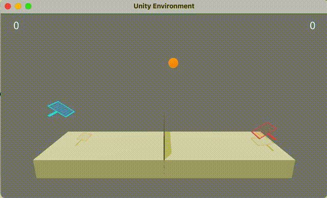
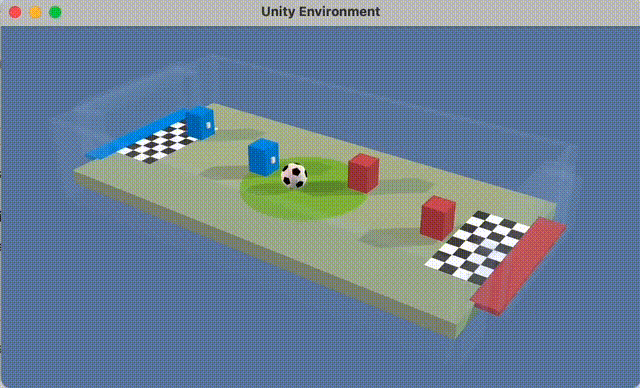
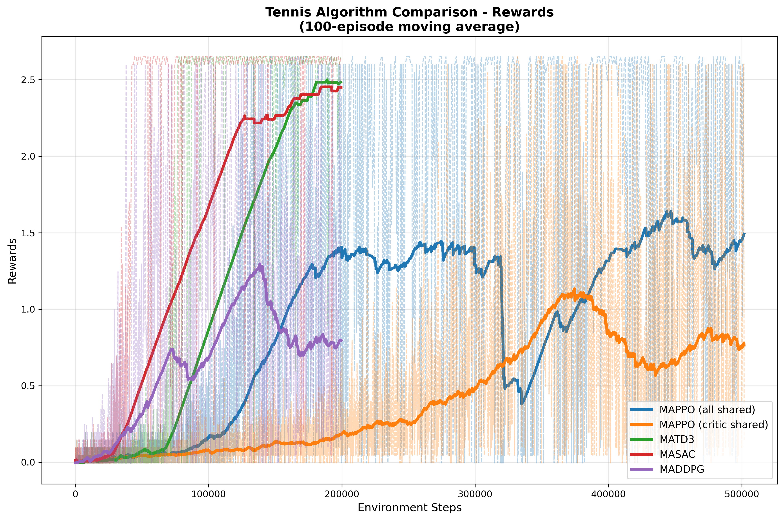

# Unity Multi-Agent Reinforcement Learning

A multi-agent reinforcement learning framework for Unity environments. Provides implementations for training and evaluating MARL algorithms on collaborative and competitive tasks.

## 🎯 Project Overview

This repository implements four multi-agent reinforcement learning algorithms for Unity environments. The framework has been validated on two environments and can be extended to support additional Unity ML-Agents environments. Train, evaluate, and compare MARL algorithms on collaborative and competitive tasks.

**Tennis** - Collaborative 2-agent environment where agents control rackets to keep a ball in play. Success requires achieving +0.5 average score over 100 episodes.



**Soccer** - Competitive 4-agent environment with 2v2 teams (goalie and striker roles with different action sizes). Agents learn to score goals while defending. Success measured by win rate against previous model versions.



## 🤖 Algorithms

- **MAPPO** (Multi-Agent Proximal Policy Optimization)
  - **All Shared**: Shared policy and critic networks across all agents
  - **Critic Shared**: Individual policies with shared centralized critic
  - **Independent**: Individual policies and critics per agent
- **MATD3** (Multi-Agent Twin Delayed Deep Deterministic Policy Gradient)
- **MASAC** (Multi-Agent Soft Actor-Critic)
  - **Independent**: Individual actors and critics per agent
  - **Shared Critic**: Individual actors with shared centralized critic
- **MADDPG** (Multi-Agent Deep Deterministic Policy Gradient)

## 📊 Results Summary

| Environment | Algorithm             | Average Score (100-ep) | Training Steps | Agents | Notes              |
| ----------- | --------------------- | ---------------------- | -------------- | ------ | ------------------ |
| Tennis      | MATD3                 | 2.483                  | ~199k steps    | 2      | Best performer     |
| Tennis      | MASAC                 | 2.450                  | ~199k steps    | 2      | Fastest to succeed |
| Tennis      | MAPPO (All Shared)    | 1.490                  | ~501k steps    | 2      | Sample inefficient |
| Tennis      | MADDPG                | 0.796                  | ~199k steps    | 2      | Successful         |
| Tennis      | MAPPO (Critic Shared) | 0.765                  | ~501k steps    | 2      | Slowest to succeed |
| Soccer      | MAPPO (Shared Critic) | 97.2% vs random        | ~1M steps      | 4      | Excellent          |
| Soccer      | MASAC (Shared Critic) | 84.4% vs random        | ~200k steps    | 4      | Very good          |

## 🚀 Quick Start

### Training

```bash
# Train MASAC on Tennis environment
python train.py --env_id Tennis --algo masac --max_steps 200000

# Train MAPPO on Soccer environment with custom config
python train.py --env_id Soccer --algo mappo --config configs/env_tuned/mappo_soccer.yaml

# Render trained models
python render.py --config results/Tennis/masac/config.yaml --model_path results/Tennis/masac/final-torch.model --worker_id 5 --render_episodes 5
```

### Visualization & Analysis

```bash
# Generate algorithm comparison plots
python render_results.py

# Create competitive evaluation plots (for Soccer)
python render_competitive_results.py
```

## 📁 Project Structure

```
├── algos/                   # Algorithm implementations (MAPPO, MATD3, MASAC, MADDPG)
├── networks/               # Neural network architectures (actors, critics, modules)
├── envs/                   # Environment wrappers for Unity ML-Agents
├── buffers/                # Experience replay and trajectory storage
├── runners/                # Training loop implementations
├── evals/                  # Evaluation metrics and competitive analysis
├── configs/                # Configuration files and hyperparameters
├── app/                    # Unity environment executables (download separately)
├── results/                # Training outputs and saved models
├── figures/                # Generated plots and visualizations
├── utils/                  # Utility functions and helpers
├── python/                 # Unity ML-Agents Python API
├── train.py               # Main training script
├── render_results.py      # Training results visualization
├── render_competitive_results.py  # Competitive evaluation plots
└── render.py              # Model rendering script
```

## 🛠️ Installation

### Prerequisites

- Python 3.11+
- Git
- Unity environments (download separately - see below)

### Option 1: Using Conda (Recommended)

```bash
# Clone the repository
git clone https://github.com/legalaspro/unity_multiagent_rl.git
cd unity_multiagent_rl

# Create and activate environment
conda env create -f environment.yaml
conda activate unity_multiagent_rl
```

### Option 2: Using Pip

```bash
# Clone the repository
git clone https://github.com/legalaspro/unity_multiagent_rl.git
cd unity_multiagent_rl

# Create virtual environment
python -m venv venv
source venv/bin/activate  # On Windows: venv\Scripts\activate

# Install dependencies
pip install -r requirements.txt
pip install -e ./python
```

### Download Unity Environments

The Unity environment executables are **not included** in this repository and must be downloaded separately:

#### Tennis Environment

Download the environment that matches your operating system:

- **Linux**: [Tennis_Linux.zip](https://s3-us-west-1.amazonaws.com/udacity-drlnd/P3/Tennis/Tennis_Linux.zip)
- **Mac OSX**: [Tennis.app.zip](https://s3-us-west-1.amazonaws.com/udacity-drlnd/P3/Tennis/Tennis.app.zip)
- **Windows (32-bit)**: [Tennis_Windows_x86.zip](https://s3-us-west-1.amazonaws.com/udacity-drlnd/P3/Tennis/Tennis_Windows_x86.zip)
- **Windows (64-bit)**: [Tennis_Windows_x86_64.zip](https://s3-us-west-1.amazonaws.com/udacity-drlnd/P3/Tennis/Tennis_Windows_x86_64.zip)
- **AWS/Headless**: [Tennis_Linux_NoVis.zip](https://s3-us-west-1.amazonaws.com/udacity-drlnd/P3/Tennis/Tennis_Linux_NoVis.zip)

#### Soccer Environment

Download the environment that matches your operating system:

- **Linux**: [Soccer_Linux.zip](https://s3-us-west-1.amazonaws.com/udacity-drlnd/P3/Soccer/Soccer_Linux.zip)
- **Mac OSX**: [Soccer.app.zip](https://s3-us-west-1.amazonaws.com/udacity-drlnd/P3/Soccer/Soccer.app.zip)
- **Windows (32-bit)**: [Soccer_Windows_x86.zip](https://s3-us-west-1.amazonaws.com/udacity-drlnd/P3/Soccer/Soccer_Windows_x86.zip)
- **Windows (64-bit)**: [Soccer_Windows_x86_64.zip](https://s3-us-west-1.amazonaws.com/udacity-drlnd/P3/Soccer/Soccer_Windows_x86_64.zip)
- **AWS/Headless**: [Soccer_Linux_NoVis.zip](https://s3-us-west-1.amazonaws.com/udacity-drlnd/P3/Soccer/Soccer_Linux_NoVis.zip)

#### Installation Steps

1. Download the appropriate environment file(s) for your operating system
2. Extract the downloaded file(s) to the `app/` directory in the project root
3. Ensure the extracted files have the correct names:
   - Tennis: `app/Tennis.app` (macOS) or `app/Tennis.exe` (Windows) or `app/Tennis` (Linux)
   - Soccer: `app/Soccer.app` (macOS) or `app/Soccer.exe` (Windows) or `app/Soccer` (Linux)

### Verify Installation

```bash
# Test the installation
python train.py --help

# Test with a short training run
python train.py --env_id Tennis --algo masac --max_steps 1000
```

## 📊 Training & Evaluation

### Training

```bash
# Basic training
python train.py --env_id Tennis --algo masac --max_steps 200000

# Use pre-configured settings
python train.py --config configs/env_tuned/mappo_tennis.yaml
```

### Rendering

```bash
# Render trained models
python render.py --config results/Tennis/masac/config.yaml --model_path results/Tennis/masac/final-torch.model --worker_id 5 --render_episodes 5
```

## 📈 Results and Visualization

All training results are stored in `results/Tennis/` and `results/Soccer/` including trained models, training data, videos, GIFs, and performance graphs.

#### Tennis Algorithm Comparison



_Shows training progress for all algorithms on Tennis environment. MATD3 and MASAC achieve the highest scores (~2.5), while MAPPO variants show steady improvement over longer training periods._

#### Soccer Competitive Evaluation


_Displays win rate against random opponents over training. MAPPO (shared critic) reaches 97%+ win rate, demonstrating superior performance in competitive multi-agent scenarios._

## 🔧 Configuration

### Algorithm Hyperparameters

Edit files in `configs/algos/` or `configs/env_tuned/` to customize:

- Learning rates
- Network architectures
- Training parameters
- Evaluation settings

## 📝 License

This project is licensed under the MIT License - see the [LICENSE](LICENSE) file for details.

## 🙏 Acknowledgments

- Unity ML-Agents Team for the environments and Python API
- OpenAI for algorithm implementations and research
- PyTorch team for the deep learning framework
