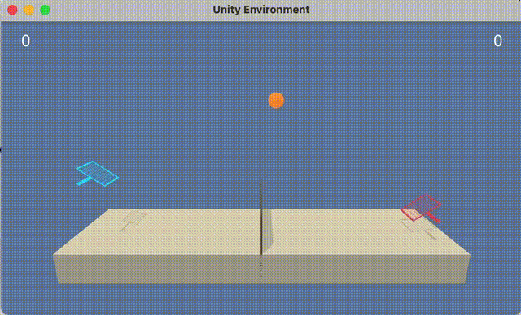
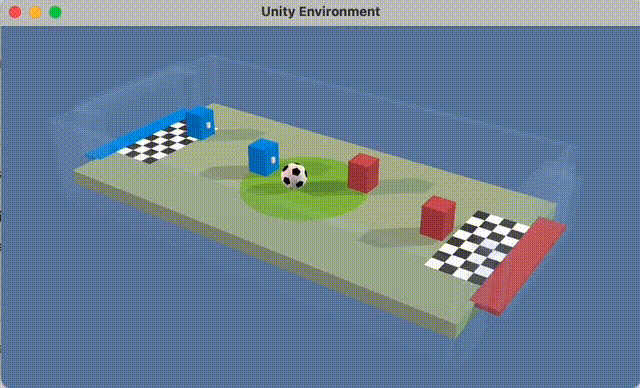

# Multi-Agent Reinforcement Learning Report

## Key Technical Insights and Innovations

This implementation includes several key technical innovations:

### 1. Gumbel-Softmax for Discrete Actions in MASAC

**Challenge**: SAC is traditionally designed for continuous action spaces, but Soccer uses discrete actions.
**Solution**: Implemented Gumbel-Softmax reparameterization trick to enable gradient-based learning for discrete actions in MASAC.

- Allows differentiable sampling from categorical distributions
- Enables the entropy regularization benefits of SAC in discrete environments
- Uses temperature annealing (τ: 1.0 → 0.5 over 100k steps) for exploration-exploitation balance

### 2. Multi-Step Learning for Sparse Rewards

**Challenge**: Soccer environment has very sparse rewards (only when goals are scored).
**Solution**: Implemented multi-step learning approaches to propagate reward signals faster.

- **Off-Policy Algorithms (MASAC)**: N-step returns (n=15) to reduce variance and accelerate learning
- **On-Policy Algorithms (MAPPO)**: GAE (Generalized Advantage Estimation) for better advantage estimation
- Both approaches help propagate sparse reward signals more effectively
- Particularly effective in environments where rewards are infrequent

### 3. Optimized Training Schedule for Off-Policy Algorithms

**Challenge**: Standard update frequencies can be inefficient for multi-agent exploration in off-policy methods.
**Solution**: Implemented learning every 50 steps with 50 gradient steps per update (for MASAC).

- Improves sample efficiency by doing more learning per environment step
- Better exploration through concentrated learning phases
- Reduces correlation between consecutive updates
- Specific to off-policy algorithms that can reuse experience data

### 4. Shared Critic Architecture with Structured Input Ordering

**Innovation**: Designed a shared critic that observes global state with consistent input structure:

- **Input Order**: [Current Agent State] → [Teammate States] → [Opponent States]
- **Action Order**: [Current Agent Actions] → [Teammate Actions] → [Opponent Actions]
- **Discrete Action Encoding**: One-hot encoding with padding to handle different action space sizes

**Benefits**:

- Critic learns faster by seeing experiences from all agents' perspectives
- Consistent data structure enables better generalization
- Shared parameters reduce overfitting and improve sample efficiency
- Critical for environments with many agents (4 agents in Soccer)

### 5. Sharing Strategy Impact Analysis

**Tennis Results** (2 agents, continuous actions, seen on MAPPO):

- **Shared Actor + Critic**: Fastest learning (leverages full parameter sharing)
- **Shared Critic Only**: Fast learning (benefits from centralized value estimation)
- **No Sharing**: Slowest learning (each agent learns independently)

**Soccer Results** (4 agents, discrete actions):

- **Shared Critic**: Essential for learning in complex 4-agent environment
- Enables coordination between teammates while competing against opponents
- Structured input ordering crucial for critic to understand team dynamics

### 6. Competitive Evaluation System for Zero-Sum Games

**Challenge**: Traditional reward-based metrics insufficient for competitive environments like Soccer where learning progress is hard to assess from sparse goal-scoring rewards.

**Solution**: Developed comprehensive competitive evaluation system:

**Win Rate vs Random Policy**:

- 16 evaluation games with random team assignments
- Provides clear learning signal despite sparse rewards

**Elo Rating System**:

- Compares current model against best previous and latest 2 models (5 games each)
- Not perfect but tracks relative improvement over training
- Demonstrates learning by beating previous versions

**Benefits**:

- Clear progress indicators for competitive environments
- Validation that agents are genuinely improving, not exploiting quirks

These innovations demonstrate that careful architectural design, training strategies, and evaluation methodologies can significantly improve multi-agent learning, especially in challenging environments with discrete actions, sparse rewards, and competitive dynamics.

## Project Overview

This report presents the implementation and evaluation of four multi-agent reinforcement learning (MARL) algorithms on two Unity ML-Agents environments: **Tennis** (collaborative) and **Soccer** (competitive). The algorithms implemented are:

1. **MAPPO** (Multi-Agent Proximal Policy Optimization)
2. **MASAC** (Multi-Agent Soft Actor-Critic)
3. **MATD3** (Multi-Agent Twin Delayed Deep Deterministic Policy Gradient)
4. **MADDPG** (Multi-Agent Deep Deterministic Policy Gradient)

All algorithms follow the **Centralized Training, Decentralized Execution (CTDE)** paradigm, where agents have access to global information during training but use only local observations during execution.

## Environment Descriptions

### Tennis Environment

**Objective**: Two agents control rackets to keep a ball in play over a net.

**Observation Space**:

- **State size**: 24 (per agent)
- **Content**: Position and velocity of ball and racket
- **Type**: Continuous (Box space)

**Action Space**:

- **Action size**: 2 (per agent)
- **Actions**: Movement toward/away from net, jumping
- **Type**: Continuous, bounded between -1 and 1

**Reward Structure**:

- **+0.1**: Agent hits ball over net
- **-0.01**: Agent lets ball hit ground or hits out of bounds
- **Episode termination**: Ball hits ground or goes out of bounds

**Success Criteria**:

- Achieve average score of **+0.5** over 100 consecutive episodes
- Score per episode = maximum score between the two agents

### Soccer Environment

**Objective**: 2v2 competitive soccer with goalies and strikers trying to score goals.

**Observation Space**:

- **Goalie agents**: 112-dimensional state vector (3 stacked observations)
- **Striker agents**: 112-dimensional state vector (3 stacked observations)
- **Content**: Positions, velocities, and orientations of players, ball, and goals
- **Type**: Continuous (Box space)

**Action Space**:

- **Goalie agents**: 4 discrete actions (movement directions)
- **Striker agents**: 6 discrete actions (movement + turning)
- **Type**: Discrete (MultiDiscrete space)

**Reward Structure**:

- **Small rewards**: Ball possession, proximity to goal

**Success Criteria**:

- Competitive performance measured by win rate against random opponents

## Learning Algorithms

### 1. Multi-Agent Proximal Policy Optimization (MAPPO)

MAPPO extends PPO to multi-agent settings using centralized training with decentralized execution.

**Key Features**:

- **Policy**: Stochastic policy with clipped surrogate objective
- **Value Function**: Centralized critic using global state information
- **Advantage Estimation**: Generalized Advantage Estimation (GAE)
- **Sharing Options**: Individual policies with shared critic, or fully shared networks

**Hyperparameters**:

```yaml
# Tennis Configuration
actor_lr: 3e-4
critic_lr: 1e-3
entropy_coef: 0.01
gamma: 0.99
gae_lambda: 0.95
clip_param: 0.2
ppo_epoch: 5
n_steps: 2048
hidden_sizes: [64, 64]

# Soccer Configuration
actor_lr: 5e-4
critic_lr: 5e-4
entropy_coef: 0.01
gamma: 0.99
gae_lambda: 0.95
clip_param: 0.2
ppo_epoch: 5
n_steps: 2048
hidden_sizes: [128, 128]
```

### 2. Multi-Agent Soft Actor-Critic (MASAC)

MASAC extends SAC to multi-agent environments with entropy regularization for exploration.

**Key Features**:

- **Policy**: Squashed Gaussian for continuous actions, Gumbel-Softmax for discrete
- **Critics**: Twin Q-networks to reduce overestimation bias
- **Temperature**: Automatic entropy tuning with learnable α parameter
- **Exploration**: Built-in entropy maximization

**MASAC Innovations**:

- **Gumbel-Softmax Reparameterization**: Enables gradient-based learning for discrete actions
- **Temperature Annealing**: τ starts at 1.0 and anneals to 0.5 over 100k steps
- **One-Hot Action Encoding**: Actions converted to one-hot vectors with padding for critic input
- **N-Step Returns**: Uses n=15 step returns to handle sparse rewards in Soccer environment
- **Optimized Training**: Learning every 50 steps with 50 gradient steps for better exploration

**Hyperparameters**:

```yaml
# Tennis Configuration
actor_lr: 3e-4
critic_lr: 3e-4
alpha_lr: 3e-4
gamma: 0.99
tau: 0.01
autotune_alpha: true
alpha_init: 0.2
batch_size: 256
buffer_size: 250000
hidden_sizes: [64, 64]

# Soccer Configuration
actor_lr: 3e-4
critic_lr: 3e-4
alpha_lr: 3e-4
gamma: 0.99
tau: 0.01
autotune_alpha: true
alpha_init: 0.2
gumbel_tau: 1.0
gumbel_tau_min: 0.5
gumbel_anneal_steps: 100000
batch_size: 512
buffer_size: 500000
hidden_sizes: [128, 128]
```

### 3. Multi-Agent Twin Delayed DDPG (MATD3)

MATD3 extends TD3 to multi-agent settings with delayed policy updates and target noise.

**Key Features**:

- **Policy**: Deterministic policy with exploration noise
- **Critics**: Twin Q-networks with delayed policy updates
- **Target Networks**: Soft updates with polyak averaging
- **Noise**: Target policy smoothing to reduce overestimation

**Hyperparameters**:

```yaml
# Tennis Configuration
actor_lr: 1e-3
critic_lr: 1e-3
gamma: 0.99
tau: 0.01
exploration_noise: 0.1
target_policy_noise: 0.2
target_noise_clip: 0.5
policy_delay: 2
batch_size: 512
buffer_size: 250000
hidden_sizes: [64, 64]
```

### 4. Multi-Agent Deep Deterministic Policy Gradient (MADDPG)

MADDPG uses centralized critics with decentralized actors for continuous control.

**Key Features**:

- **Policy**: Deterministic policy with Gaussian noise
- **Critics**: Centralized critics observing all agents' states and actions
- **Experience Replay**: Shared replay buffer across all agents
- **Target Networks**: Soft updates for stability

**Hyperparameters**:

```yaml
# Tennis Configuration
actor_lr: 1e-3
critic_lr: 1e-3
gamma: 0.99
tau: 0.01
exploration_noise: 0.1
batch_size: 256
buffer_size: 250000
hidden_sizes: [64, 64]
```

## Neural Network Architectures

### Actor Networks

**Continuous Actions (Tennis)**:

- **Architecture**: Fully connected layers with ReLU activation and LayerNorm
- **Input**: State observation (24 dimensions)
- **Hidden Layers**: [64, 64] or [128, 128] neurons
- **Output**: Action values with Tanh activation (bounded to [-1, 1])
- **Initialization**: Orthogonal initialization for hidden layers, uniform for output

**Discrete Actions (Soccer)**:

- **Architecture**: Fully connected layers with ReLU activation and LayerNorm
- **Input**: State observation (112 dimensions)
- **Hidden Layers**: [128, 128] neurons
- **Output**: Action logits for discrete action selection
- **Special**: Gumbel-Softmax for reparameterizable discrete sampling in MASAC

### Critic Networks

**Shared Critic Architecture** (Key Innovation):

- **Structured Input Ordering**: [Current Agent State] → [Teammate States] → [Opponent States]
- **Action Ordering**: [Current Agent Actions] → [Teammate Actions] → [Opponent Actions]
- **Discrete Action Handling**: One-hot encoding with padding for different action space sizes
- **Benefits**: Faster learning by seeing all agents' experiences with consistent data structure

**Single Q-Network**:

- **Input**: Concatenated global state and joint actions
- **Architecture**: [state_size + action_size] → [hidden_sizes] → 1
- **Hidden Layers**: [64, 64] or [128, 128] with ReLU and LayerNorm
- **Output**: Single Q-value

**Twin Q-Networks** (MASAC, MATD3):

- **Architecture**: Two identical Q-networks to reduce overestimation
- **Input**: Global state and joint action concatenation (with structured ordering)
- **Output**: Two Q-value estimates, minimum used for target computation

**Value Network** (MAPPO):

- **Input**: Global state information (centralized with structured ordering)
- **Architecture**: [global_state_size] → [hidden_sizes] → 1
- **Output**: State value estimate

### Weight Initialization

- **Hidden Layers**: Orthogonal initialization with ReLU gain
- **Output Layers**: Uniform initialization with small gain (3e-3)
- **LayerNorm**: Weights initialized to 1, biases to 0

## Training Results

### Tennis Environment Results

| Algorithm                 | Episodes to Solve | Final Average Score | Training Steps | Notes                  |
| ------------------------- | ----------------- | ------------------- | -------------- | ---------------------- |
| **MASAC**                 | 1,330             | 2.450               | ~199k          | Fastest to solve       |
| **MATD3**                 | 2,663             | 2.483               | ~199k          | Best final performance |
| **MADDPG**                | 1,270             | 0.796               | ~199k          | Solved but lower score |
| **MAPPO (All Shared)**    | 3,397             | 1.490               | ~501k          | Sample inefficient     |
| **MAPPO (Critic Shared)** | 5,980             | 0.765               | ~501k          | Slowest to solve       |

**Key Observations**:

- **MASAC** achieved the fastest convergence to the +0.5 threshold (benefits from Gumbel-Softmax and entropy regularization)
- **MATD3** achieved the highest final performance (2.483 average score)
- **MAPPO** variants required significantly more episodes but eventually succeeded
- **Sharing Strategy Impact**: MAPPO (All Shared) > MAPPO (Critic Shared) > Individual networks
- All algorithms successfully solved the environment
- **Shared Critic Benefits**: Faster learning through centralized value estimation with structured input ordering

### Soccer Environment Results

| Algorithm                 | Win Rate vs Random | Training Steps | Notes                       |
| ------------------------- | ------------------ | -------------- | --------------------------- |
| **MAPPO (Shared Critic)** | 97.2%              | ~1M            | Excellent performance       |
| **MASAC (Shared Critic)** | 84.4%              | ~200k          | Very good, sample efficient |

**Key Observations**:

- **MAPPO** achieved superior competitive performance (97.2% win rate) with shared critic architecture
- **MASAC** required implementing multiple techniques to make learning work in this challenging environment: Gumbel-Softmax for discrete actions, n-step learning for sparse rewards, and optimized training schedule
- **Shared Critic Essential**: Critical for 4-agent coordination with structured input ordering
- **Environment Complexity**: Soccer proved quite challenging, requiring specialized techniques beyond standard algorithms
- Both algorithms significantly outperformed random policies after implementing appropriate modifications

## Results Visualization

### Trained Agent Demonstrations

<div align="center">
  
  
</div>

_Left: MASAC agents playing Tennis (collaborative). Right: MASAC agents playing Soccer (competitive)._

### Tennis Training Progress


The plot shows training progress for all algorithms on the Tennis environment. Key observations:

- **MATD3** and **MASAC** achieve the highest scores (~2.5) with relatively stable learning
- **MAPPO** variants show steady but slower improvement over longer training periods
- **MADDPG** reaches the success threshold but plateaus at a lower performance level
- All algorithms eventually surpass the +0.5 success criteria

### Soccer Competitive Evaluation


The plot displays win rate against random opponents during training:

- **MAPPO (Shared Critic)** reaches 97%+ win rate, demonstrating superior performance
- **MASAC (Shared Critic)** achieves 84%+ win rate with faster initial learning
- Both algorithms show consistent improvement and maintain high performance

**Additional Evaluation Metrics**:


The Soccer environment also includes Elo rating system evaluation that tracks performance against previous model versions. The Elo rating graphs demonstrate that both algorithms consistently improve by beating their previous versions, providing strong evidence of genuine learning progress rather than exploitation of environment quirks. This evaluation system was crucial for understanding learning progress in the sparse reward Soccer environment where traditional reward metrics were insufficient.

## Ideas for Future Work

### 1. Advanced Algorithm Improvements

**Hierarchical Multi-Agent RL**:

- High-level coordinators with low-level execution policies
- Beneficial for role-based agents like Soccer goalies/strikers

**Attention Mechanisms**:

- Dynamic focus on relevant agents/objects
- Better scalability to larger multi-agent scenarios

**Meta-Learning Approaches**:

- Quick adaptation to new team compositions or strategies
- Transfer learning between similar environments

### 2. Network Architecture Enhancements

**Immediate Architecture Improvements**:

- **Global State Optimization**: Remove redundant information from concatenated observations
- **Universal Shared Actor**: Handle multiple agent types with different action space sizes
- **Add RNN to MAPPO**: Memory for better temporal coordination

**Advanced Architecture Research**:

- **GNNs**: Model agent interactions as graphs
- **Transformers**: Attention for coordination strategies

### 3. Training Stability and Efficiency

**Advanced Replay Buffers**:

- Implement Prioritized Experience Replay (PER)
- Use Hindsight Experience Replay (HER) for sparse rewards
- Develop multi-agent specific replay strategies

These future directions would significantly enhance the framework's capabilities and enable deployment to more complex multi-agent scenarios.
